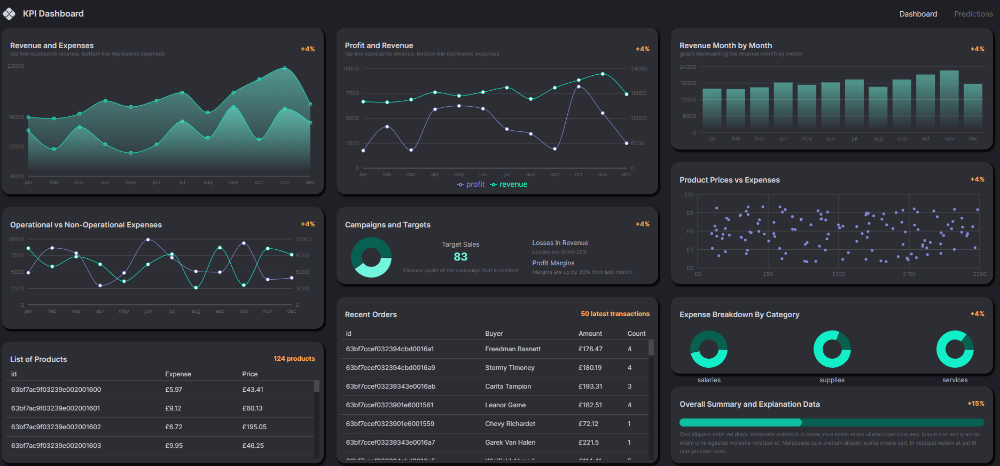
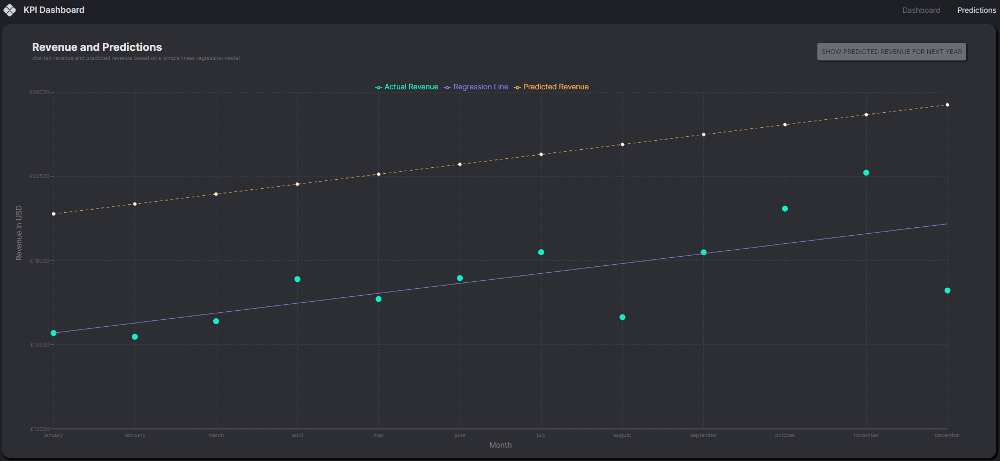

# Financial-Dashboard
This is a full-stack web application built with the MERN stack (MongoDB, Express, React, and Node.js). The application provides a dashboard that displays financial KPIs using data retrieved from a MongoDB database.

## The main Dashboard

## The Predictions Page

## Installation
To install and run this application on your local machine, follow these steps:

Clone the repository to your local machine:
git clone <https://github/7Jay-Lee7/Financial-Dashboard.git>

### Navigate to the client folder and install the dependencies:
* cd client
* npm install

### Create a .env.local file in the client folder and set your VITE_URL environment variable:
* VITE_URL=<your-vite-url>
* Run the development server:
* npm run dev

### Open a new terminal window, navigate to the server folder, and install the dependencies:
* cd ../server
* npm install
* Create a .env file in the server folder and set your MONGO_URL and PORT environment variables:
* MONGO_URL=<your-mongo-url>
* PORT=<your-port>

### Start the server:
* npm run start
* Open your browser and navigate to http://localhost:5137 to access the application.

## Technology Stack
* MongoDB
* Express.js
* React
* Node.js
* Vite
* TypeScript
* @emotion
* @mui
* Redux
* Recharts
* Regression
* Nodemon

### Contributing
If you find any bugs or have suggestions for improving the application, please feel free to submit a pull request or open an issue on GitHub.

### License
This project is licensed under the MIT License - see the LICENSE.md file for details.
